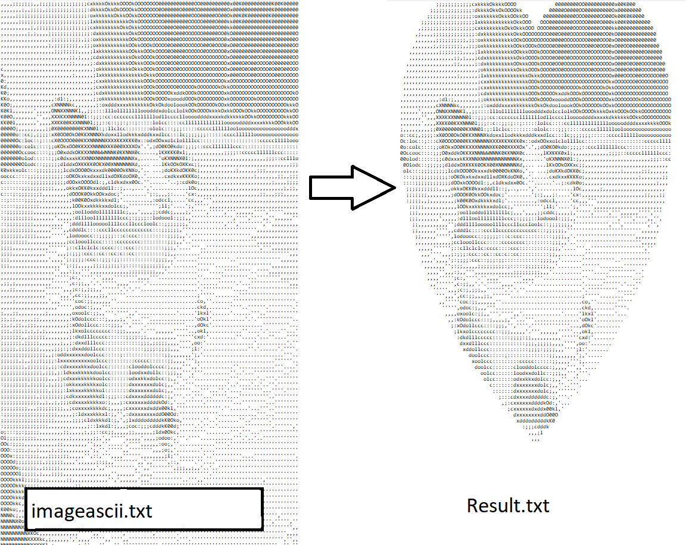

# 🖤 ASCII Heart Shape Generator

Un programa que recibe imágenes en arte ASCII y las muestra dentro de una forma de corazón.

(Deberás de buscar tu propio método para convertir imágenes normales a ASCII de buena calidad, pero aquí te dejo un pequeño [script](./heart_ascii.py) que lo hace rápidamente).

<div align="center">
  
</div>

## 📋 Descripción de Archivos
- **`heart.cpp`** - Programa que crea un corazón con un solo carácter pre-indicado. (Solo sirve para entender la función y ecuación de la forma del corazón).

- **`heart_ascii.py`** - Script Python para convertir imágenes a ASCII (opcional).
- **`imageascii.txt`** - Tu imagen ASCII original.

- **`super_heart.cpp`** - Programa principal en C++ que genera el corazón ASCII.
- **`super_heart`** - Ejecutable compilado (se genera después de compilar).

## 🔧 Instalación y Compilación

### Prerrequisitos
```bash
# Asegurar que tienes g++ instalado
sudo apt update
sudo apt install g++ build-essential
```

### Compilación del Programa
```bash
# Navegar al directorio del proyecto

# Compilar el programa C++
g++ -o super_heart super_heart.cpp
```

**Explicación:**
- `g++` - Compilador de C++
- `-o super_heart` - Especifica el nombre del ejecutable
- `super_heart.cpp` - Archivo fuente de C++

## 🚀 Uso del Programa

### Ejecutar y Mostrar en Consola (Con Colores)
```bash
./super_heart imageascii.txt
"Press Enter"
```

**Explicación paso a paso:**
1. `./super_heart` - Ejecuta el programa compilado
2. `imageascii.txt` - Archivo con tu imagen ASCII original

### Guardar en Archivo (Sin Colores)
```bash
./super_heart imageascii.txt heart_shape.txt
```

**Resultado:** Se guardará en `heart_shape.txt` sin códigos de color ANSI.

## 🎨 Características

- ✅ **Imagen ASCII intocable** - La imagen original nunca se modifica
- ✅ **Corazón adaptable** - Se ajusta automáticamente a las dimensiones de tu imagen
- ✅ **Salida dual** - Consola con colores o archivo sin colores

## 📊 Especificaciones Técnicas

- **Dimensiones de entrada:** 100×81 caracteres (detectadas automáticamente)
- **Algoritmo:** Ecuación matemática del corazón: `(x² + y² - 1)³ - x²y³ ≤ 0`
- **Colores:** ANSI escape codes (rojo para arte, blanco para fondo)
- **Compilador:** G++ con C++ estándar

## 🔍 Comandos de Diagnóstico

### Verificar Compilación
```bash
file super_heart
```
**Resultado esperado:** `super_heart: ELF 64-bit LSB executable`

### Verificar Imagen ASCII
```bash
wc -l imageascii.txt
```

## 🎯 Uso Diario (Comandos Rápidos)

### Compilar (Solo cuando modificas el código)
```bash
g++ -o super_heart super_heart.cpp
```

### Ejecutar (Uso normal)
```bash
./super_heart imageascii.txt
"Press Enter"
```

## 🐛 Solución de Problemas

### Error: "No such file or directory"
```bash
# Verificar que estás en el directorio correcto
pwd

```

### Error de Compilación
```bash
# Verificar que g++ está instalado
g++ --version

# Reinstalar si es necesario
sudo apt install g++ build-essential
```

### No se Ve el Corazón
```bash
# Verificar que imageascii.txt existe y tiene contenido
ls -la imageascii.txt
head -5 imageascii.txt
```

## 📝 Notas Importantes

- El programa preserva **exactamente** los caracteres originales de tu imagen.
- Solo muestra los píxeles que caen dentro de la forma matemática del corazón.
- Los colores solo aparecen en la consola, no en archivos guardados.
- El corazón se adapta automáticamente al tamaño de cualquier imagen ASCII.

**¡Disfruta tu corazón ASCII personalizado!** 🖤❤️